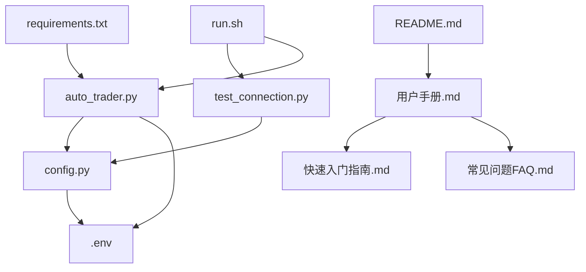

# 📁 项目结构说明

## 🌟 项目概览

这个自动交易脚本项目包含了完整的功能实现和详细的文档，每个文件都有明确的作用。

## 📂 文件结构

```
auto-trader/
├── 📄 核心程序文件
│   ├── auto_trader.py          # 主要的自动交易脚本
│   ├── config.py               # 配置管理模块
│   └── test_connection.py      # API连接测试脚本
│
├── 📝 配置文件
│   ├── requirements.txt        # Python依赖包列表
│   ├── env.example            # 环境变量配置模板
│   ├── .env                   # 实际环境变量文件（用户创建）
│   └── .gitignore             # Git忽略文件配置
│
├── 🚀 启动脚本
│   ├── run.sh                 # Linux/Mac启动脚本
│   └── run.bat                # Windows启动脚本
│
├── 📚 文档文件
│   ├── README.md              # 项目主要说明文档
│   ├── 用户手册.md            # 详细的用户使用手册
│   ├── 快速入门指南.md        # 5分钟快速上手指南
│   ├── 常见问题FAQ.md         # 常见问题解答
│   └── 项目结构说明.md        # 本文件
│
├── ⚖️ 项目管理
│   ├── LICENSE                # MIT开源许可证
│   └── setup.py               # Python包安装配置
│
└── 📊 运行时文件（自动生成）
    └── auto_trader.log         # 运行日志文件
```

---

## 📄 核心程序文件

### `auto_trader.py` - 主程序
> **作用**: 自动交易脚本的核心文件

**主要功能**:
- 🤖 **AutoTrader类**: 核心交易逻辑
- ⏰ **时间监控**: 持续监控当前时间
- 📅 **交易日判断**: 自动识别交易日
- 📈 **下单功能**: 执行股票买入操作
- 📝 **日志记录**: 详细记录所有操作
- 🔧 **命令行接口**: 支持多种运行模式

**重要方法**:
```python
class AutoTrader:
    def is_trading_day()     # 检查是否为交易日
    def place_buy_order()    # 提交买单
    def should_trade_now()   # 判断是否应该交易
    def run_continuous()     # 持续运行模式
```

### `config.py` - 配置管理
> **作用**: 统一管理所有配置参数

**主要功能**:
- 📖 **配置加载**: 从环境变量读取配置
- ✅ **参数验证**: 检查配置的有效性
- 🔄 **配置解析**: 处理不同类型的参数
- 🛡️ **安全检查**: 验证必需参数

**配置项说明**:
```python
class Config:
    api_key          # Alpaca API密钥ID
    secret_key       # Alpaca API密钥Secret
    base_url         # API基础URL
    trading_symbol   # 交易股票代码
    trading_quantity # 买入数量
    trigger_time     # 触发时间
```

### `test_connection.py` - 连接测试
> **作用**: 验证API连接和配置正确性

**测试内容**:
- 🔗 **API连接**: 测试Alpaca API是否可达
- 📊 **账户信息**: 获取账户状态和余额
- 📅 **交易日历**: 检查今天是否为交易日
- ⚙️ **配置验证**: 确认所有配置正确

---

## 📝 配置文件

### `requirements.txt` - 依赖包
> **作用**: 定义项目所需的Python包

**包含的依赖**:
```txt
alpaca-trade-api>=3.2.0    # Alpaca交易API
pytz>=2023.3               # 时区处理
python-dotenv>=1.0.0       # 环境变量管理
pandas>=1.5.0              # 数据处理
numpy>=1.24.0              # 数值计算
requests>=2.28.0           # HTTP请求
```

### `env.example` - 配置模板
> **作用**: 环境变量配置的示例模板

**模板内容**:
```env
# API配置
APCA_API_KEY_ID=your_api_key_here
APCA_API_SECRET_KEY=your_secret_key_here
APCA_BASE_URL=https://paper-api.alpaca.markets

# 交易配置
TRADING_SYMBOL=QQQ
TRADING_QUANTITY=1
TRIGGER_TIME=15:50
```

### `.env` - 实际配置
> **作用**: 用户的实际配置文件（需要用户创建）

**注意事项**:
- ⚠️ 包含敏感信息，不会上传到Git
- 📝 用户需要根据 `env.example` 创建
- 🔒 存储真实的API密钥

### `.gitignore` - 忽略文件
> **作用**: 定义Git不跟踪的文件

**忽略内容**:
- 🔐 环境变量文件 (`.env`)
- 📊 日志文件 (`*.log`)
- 🐍 Python缓存 (`__pycache__/`)
- 🖥️ IDE配置文件
- 📂 虚拟环境目录

---

## 🚀 启动脚本

### `run.sh` - Linux/Mac启动脚本
> **作用**: 一键启动自动交易脚本（Unix系统）

**执行流程**:
1. 🔍 检查Python版本
2. 🔄 激活虚拟环境（如果存在）
3. 📝 检查配置文件
4. 🧪 测试API连接
5. 🚀 启动交易脚本

**使用方法**:
```bash
./run.sh              # 默认运行
./run.sh --once       # 只运行一次
./run.sh --interval 30 # 自定义间隔
```

### `run.bat` - Windows启动脚本
> **作用**: Windows系统的启动脚本

**功能同 `run.sh`**，但适配Windows命令语法。

---

## 📚 文档文件

### `README.md` - 项目主文档
> **作用**: 项目的主要说明文档

**内容包括**:
- 📖 项目介绍和功能特点
- 🛠️ 安装和配置指南
- 🚀 基本使用方法
- ⚙️ 配置参数说明
- 🔧 故障排除指南

### `用户手册.md` - 详细手册
> **作用**: 面向新手的完整使用手册

**详细内容**:
- 🔰 从零开始的完整教程
- 📖 逐步安装指导
- ⚙️ 详细配置说明
- 🎯 实际使用案例
- 🛡️ 安全使用指南

### `快速入门指南.md` - 快速上手
> **作用**: 5分钟快速上手指南

**适合对象**:
- ⚡ 有一定基础的用户
- 🚀 想要快速测试的用户
- 🔄 已经熟悉类似工具的用户

### `常见问题FAQ.md` - 问题解答
> **作用**: 解答用户常见问题

**问题分类**:
- 🔰 基础问题
- 🛠️ 安装问题
- ⚙️ 配置问题
- 🏃 运行问题
- 📈 交易问题
- 🔒 安全问题

---

## ⚖️ 项目管理

### `LICENSE` - 开源许可证
> **作用**: 定义项目的使用许可

**许可类型**: MIT License
**权限**: 允许自由使用、修改、分发

### `setup.py` - 安装配置
> **作用**: Python包的安装配置文件

**功能**:
- 📦 定义包信息
- 📋 指定依赖关系
- 🔧 配置命令行入口
- 📝 设置元数据

---

## 📊 运行时文件

### `auto_trader.log` - 运行日志
> **作用**: 记录脚本运行的详细信息

**日志内容**:
- ⏰ 时间戳信息
- 📊 账户状态
- 📈 交易记录
- ❌ 错误信息
- 🔧 调试信息

**日志格式**:
```
2025-07-10 13:35:03,397 - INFO - 🕒 2025-07-10 13:35:03 是交易日，触发下单
2025-07-10 13:35:03,397 - INFO - ⏳ 准备提交 QQQ 买单...
2025-07-10 13:35:03,441 - INFO - ✅ 已提交 1 股 QQQ 市价买单
```

---

## 🔄 文件依赖关系



## 🎯 使用建议

### 新手用户
1. 📚 先阅读 `快速入门指南.md`
2. 📖 详细阅读 `用户手册.md`
3. 🧪 运行 `test_connection.py` 测试
4. 🚀 使用启动脚本运行

### 高级用户
1. 📄 查看 `README.md` 了解概况
2. 🔧 直接修改 `auto_trader.py`
3. ⚙️ 自定义 `config.py`
4. 📊 分析 `auto_trader.log` 优化策略

### 开发者
1. 📁 理解项目结构
2. 🔍 阅读源代码注释
3. 🧪 运行测试脚本
4. 🔄 提交Pull Request

---

## 💡 文件管理建议

### 重要文件备份
- 🔐 `.env` - 包含API密钥，务必备份
- 📊 `auto_trader.log` - 交易记录，定期备份
- ⚙️ 自定义配置文件

### 定期清理
- 📊 清理过大的日志文件
- 🗑️ 删除临时文件
- 🔄 更新依赖包

### 安全管理
- 🔒 不要将 `.env` 文件分享给他人
- 📝 定期更换API密钥
- 🛡️ 使用防火墙保护系统

---

**这个项目结构设计考虑了易用性、安全性和可维护性，无论您是新手还是专家，都能找到合适的使用方式！**

*最后更新: 2025年7月10日* 